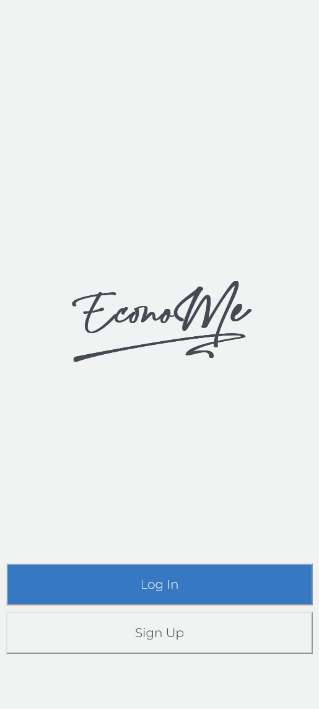
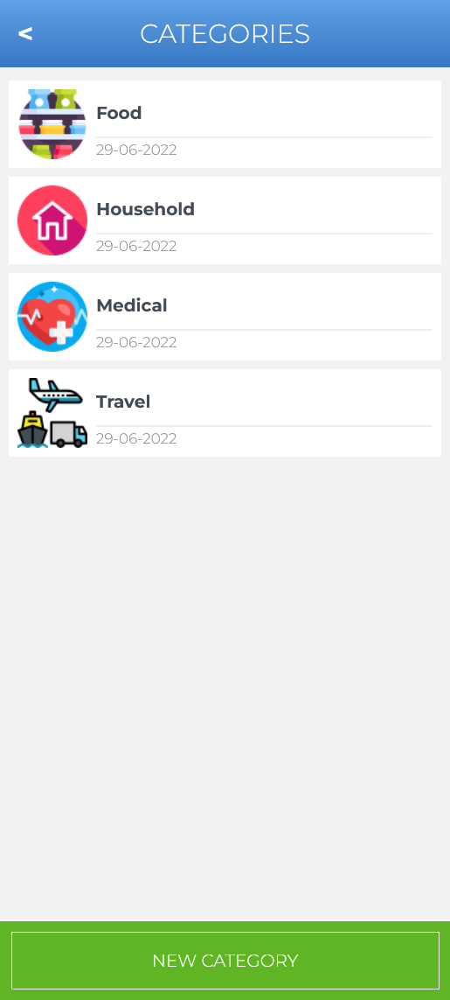
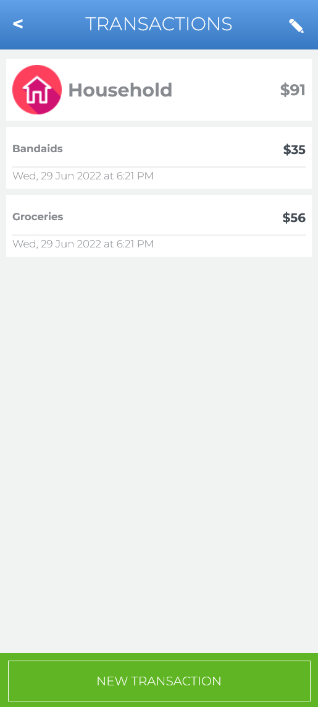
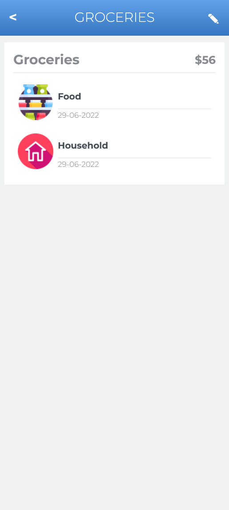

# EconoMe

> A budgeting app, where you can put in your daily expenditure, sort it into categories, and then see the breakdown of the expenditures per category. Made with Ruby on Rails.

# [Live Demo](http://146.190.214.105/)

 |   |   |   |
 | - |:-:| -:|
 | |  |  |

## Built With

- Ruby 3.1.2
- Rails 7.0.3
- Rubocop
- Devise
- Rspec
- Capybara

## Getting Started

To get a local copy up and running follow these simple example steps.

### Prerequisites
- Ruby
- PostgreSQL
- RubyGems
- Node.js
- Yarn
- Rails
### Setup
- Clone the repository using `git clone https://github.com/qwibbler/blogoverse`.
- `cd` into the project folder.
- Update your database credentials in the `\config\database.yml`.

### Install
- Run `bundle install` in your terminal to install all the required dependencies.
- Run `rails db:setup` to configure your database.
- Run `rails s` to start the server.
- Go to `localhost:3000` (or whatever port the server is listening on).

### Usage
- You can sign up with new user, or log in if you already have an account.
- You will start with some default categories, but you can add as many new ones as you like.
- You can add an icon to each category, to quickly and easily recognize it.
- You can view all the utransactions in a given category as well as their total price.
- You can vieweach individual transaction in detail.
### Run tests
- Run `rails db:seed RAILS_ENV=test` to seed the test database.
- Run `rspec` in your terminal.
<!-- ### Deployment -->

## Authors

👤 **Humaira Zaman**

- GitHub: [@qwibbler](https://github.com/qwibbler)
- Twitter: [@hmemaz](https://twitter.com/hmemaz)
- LinkedIn: [Humaira Zaman](https://www.linkedin.com/in/hmemaz1994/)

## 🤝 Contributing

Contributions, issues, and feature requests are welcome!

Feel free to check the [issues page](../../issues/).

## Show your support

Give a ⭐️ if you like this project!

## Acknowledgments

- Original design idea by [Gregoire Vella on Behance](https://www.behance.net/gregoirevella).
- Icons taken from [Flaticon](https://www.flaticon.com/).

## 📝 License
This project is [MIT](./MIT.md) licensed.
